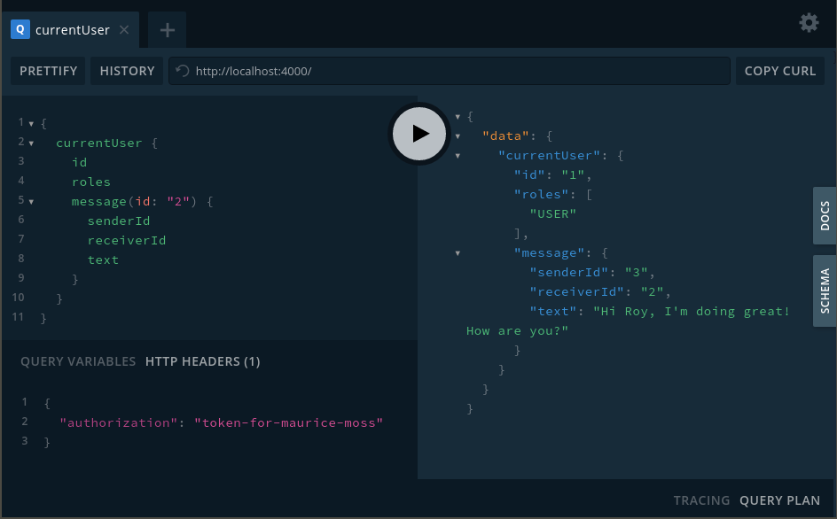
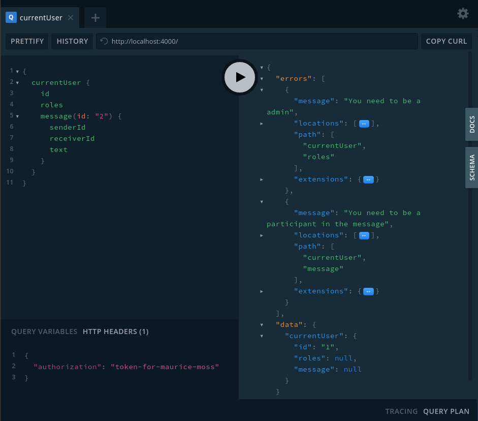

Authentication and Authorization with GraphQL can be a confusing topic. There is not a lot of best practices and little content on this topic.

This article aims at comparing three different ways of implementing authorization (meaning how to decide which user is allowed to see what). We will have a look at resolver-based access control, implementing an authorization directive and use a permission library called GraphQL Shield.

If you're interested in authentication (meaning how to decide who the current user is) you can have a look at [this series of blog posts](https://jkettmann.com/authentication-and-authorization-with-graphql-and-passport/).

The code examples for this article can be found [here on GitHub](https://github.com/jkettmann/authorization-with-graphql). The code for each example is in a different branch.

## The initial server

Before we have a look at different ways to handle authorization let's implement the initial server including a simple authentication. We will use this server as a starting point for the three authorization options.

    import { ApolloServer } from 'apollo-server';
    import User from './User';
    import Message from './Message';
    import typeDefs from './typeDefs';
    import resolvers from './resolvers';

    const server = new ApolloServer({
      typeDefs,
      resolvers,
      context: ({ req }) => {
        const token = req.headers.authorization;
        const currentUser = User.getUserByToken(token);
        return { user: currentUser, User, Message }
      },
    });

    server.listen().then(({ url }) => console.log(`🚀 Server ready at ${url}`));

`User` and `Message` represent database models and are passed to the context. This way we can use them in the resolvers.

The authentication is pretty simple. We read a token from the request headers. With this token, we retrieve the corresponding user from the database and add it to the context. Now it can be accessed inside the resolvers as well.

The GraphQL type definitions look like the following.

    import { gql } from 'apollo-server';

    const typeDefs = gql`
      enum Role {
        ADMIN
        USER
      }

      type Message {
        id: ID
        receiverId: ID
        senderId: ID
        text: String
      }

      type User {
        id: ID
        firstName: String
        lastName: String
        email: String
        roles: [Role]
        message(id: ID!): Message
      }

      type Query {
        currentUser: User
      }
    `;

    export default typeDefs;

We have a `currentUser` field which is supposed to contain the currently logged-in user's data. The user has a `message` field which returns a `Message` object according to a given ID.

The resolvers are fairly simple. The current user is directly returned from the context. The message resolver gets the data by calling the database model.

    const resolvers = {
      User: {
        message: (user, args, context) => context.Message.getById(args.id)
      },
      Query: {
        currentUser: (parent, args, context) => context.user
      },
    };

    export default resolvers;

Finally, let's have a look at the database models. Since we want to focus on authorization we don't use a real database but rather hard-coded data.

Here is the `User` model:

    const users = [
      {
        id: '1',
        token: 'token-for-maurice-moss',
        firstName: 'Maurice',
        lastName: 'Moss',
        email: 'maurice@moss.com',
        password: 'abcdefg',
        roles: ['USER'],
      },
      {
        id: '2',
        token: 'token-for-roy-trenneman',
        firstName: 'Roy',
        lastName: 'Trenneman',
        email: 'roy@trenneman.com',
        password: 'imroy',
        roles: ['USER', 'ADMIN'],
      },
      {
        id: '3',
        token: 'token-for-jen-barber',
        firstName: 'Jen',
        lastName: 'Barber',
        email: 'jen@barber.com',
        password: 'qwerty',
        roles: ['USER'],
      }
    ];

    export default {
      getUserByToken: (token) => users.find((user) => user.token === token),
    };

And here the `Message` model:

    const messages = [
      {
        id: '1',
        senderId: '2',
        receiverId: '3',
        text: 'Hey Jen, how are you doing?',
      },
      {
        id: '2',
        senderId: '3',
        receiverId: '2',
        text: 'Hi Roy, I\'m doing great! How are you?',
      },
    ];

    const getById = (id) => messages.find((message) => message.id === id);

    const getParticipantIds = (id) => {
      const message = getById(id);

      if (!message) {
        return [];
      }

      return [
        message.senderId,
        message.receiverId,
      ];
    }

    export default {
      getById,
      getParticipantIds,
    };

You can run the server by executing `npm start`. This will open the GraphQL playground at [localhost:4000](http://localhost:4000). You can pick one of the user tokens above (like `token-for-maurice-moss`) and set it as authorization header. Try to run the following query.

When you have a closer look you will realize the user in the query above should not be allowed to read the message data since he is neither receiver nor sender of the message. Additionally, we only want to expose the `roles` field to users with role `ADMIN`.

In the following chapters, we will have a look at different ways to implement this with GraphQL and Apollo server.

## Option 1: Authorization in resolvers

One of the most obvious and, at the same time, the most flexible options is handling authorization in your resolvers.

We start by writing a couple of assert functions to check if a user is logged in, has the admin role and is a participant of a given message.

    import { AuthenticationError } from 'apollo-server';

    export const assertAuthenticated = (context) => {
      if (!context.user) {
        throw new AuthenticationError('You need to be logged in');
      }
    };

    export const assertAdmin = (context) => {
      assertAuthenticated(context);

      if (!context.user.roles.includes('ADMIN')) {
        throw new AuthenticationError('You need to be a admin');
      }
    };

    export const assertMessageParticipant = (messageId, context) => {
      assertAuthenticated(context)

      const participantIds = context.Message.getParticipantIds(messageId)
      if (!participantIds.includes(context.user.id)) {
        throw new AuthenticationError('You need to be a participant in the message');
      }
    }

In each function, we check a simple condition and throw an `AuthenticationError` if this condition is not met.

In `assertAdmin` we chain multiple conditions. The pre-condition is that the user is logged in. Then we check if the user has the admin role.

In `assertMessageParticipant` we query the database to check if the logged-in user is one of the message's participants.

Now we simply call theses assertions in our resolvers.

    import {
      assertAdmin,
      assertMessageParticipant,
      assertAuthenticated,
    } from './permissions';

    const resolvers = {
      User: {
        message: (user, args, context) => {
          assertMessageParticipant(args.id, context)

          return context.Message.getById(args.id);;
        },
        roles: (user, args, context) => {
          assertAdmin(context);

          return user.roles;
        }
      },
      Query: {
        currentUser: (parent, args, context) => {
          assertAuthenticated(context);

          return context.user;
        }
      },
    };

When you run the query from the first chapter again you will see two authorization errors inside the response's `errors` array. If you use the token `token-for-roy-trenneman` the errors should be gone.

Handling access-control in the resolver like this is an easy and clean option. The biggest benefit, in my opinion, is that this implementation is very flexible.

Let's say you don't want to throw errors from your resolvers but rather add an optional field `error` to your types. This way the errors won't end up in the response's `errors` array as above but you can handle them inside your frontend directly where you are querying the data. Here is a [great talk by Sascha Solomon from Twitter](https://www.youtube.com/watch?v=A5-H6MtTvqk) about this topic.

Adjusting our authentication logic to this way of error handling wouldn't be too hard. You wouldn't be able to easily do this with the next options, though.

## Option 2: Authorization directive

Directives in GraphQL are a way to execute a piece of logic before or after a field resolves. This makes them a good candidate to handle our authorization. In this chapter, we will discuss a possible implementation rather quickly. If you want more detailed information have a look at [this dedicated blog post](https://jkettmann.com/authorization-with-graphql-and-custom-directives/).

Let's start by defining the directive inside the schema.

    directive @auth(
      requires: Role!,
    ) on FIELD_DEFINITION

    enum Role {
      ADMIN
      MESSAGE_PARTICIPANT
      USER
    }

    type User {
      id: ID
      firstName: String
      lastName: String
      email: String
      roles: [Role] @auth(requires: ADMIN)
      message(id: ID!): Message @auth(requires: MESSAGE_PARTICIPANT)
    }

    type Query {
      currentUser: User @auth(requires: USER)
    }

At the top, we define the `@auth` directive which expects a role to be provided. We add another role called `MESSAGE_PARTICIPANT` to be handled by the new directive. Inside the `User` and `Query` types we annotate the `roles`, `message` and `currentUser` fields with the directive and the corresponding roles.

The implementation of the directive may look complicated at first. But mainly we replace an annotated field's original resolver and add some custom authorization logic.

First, let's only check if the user has the required role. This will be sufficient for controlling access to the `currentUser` and `roles` fields.

    import { AuthenticationError, SchemaDirectiveVisitor } from 'apollo-server';
    import { defaultFieldResolver } from 'graphql';

    class AuthDirective extends SchemaDirectiveVisitor {
      visitFieldDefinition(field) {
        const requiredRole = this.args.requires;
        const originalResolve = field.resolve || defaultFieldResolver;

        field.resolve = async function(...args) {
          const context = args[2];
          const user = context.user || {};
          const userRoles = user.roles || [];
          const isUnauthorized = !userRoles.includes(requiredRole);

          if (isUnauthorized) {
            throw new AuthenticationError(`You need following role: ${requiredRole}`);
          }

          return originalResolve.apply(this, args);
        }
      }
    }

    export default AuthDirective;

Finally, we need to tell the Apollo server to use the directive.

    ...
    import AuthDirective from './AuthDirective';

    const server = new ApolloServer({
      ...
      schemaDirectives: {
        auth: AuthDirective,
      },
    });

    ...

At this point, our role-based access control is working fine.

Authorization of the `message` field is a bit more complicated though since it depends on the message object itself.

    import { AuthenticationError, SchemaDirectiveVisitor } from 'apollo-server';
    import { defaultFieldResolver } from 'graphql';

    const assertMessageParticipant = (user, message) => {
      const isReceiver = user.id === message.receiverId;
      const isSender = user.id === message.senderId;
      if (!isReceiver && !isSender) {
        throw new AuthenticationError('You need to be a participant in the message');
      }
    }

    class AuthDirective extends SchemaDirectiveVisitor {
      visitFieldDefinition(field) {
        const requiredRole = this.args.requires;
        const originalResolve = field.resolve || defaultFieldResolver;

        field.resolve = async function(...args) {
          const context = args[2];
          const user = context.user || {};
          const userRoles = user.roles || [];
          const requiresParticipant = requiredRole === 'MESSAGE_PARTICIPANT';
          const isUnauthorized = !requiresParticipant && !userRoles.includes(requiredRole);

          if (isUnauthorized) {
            throw new AuthenticationError(`You need following role: ${requiredRole}`);
          }

          const data = await originalResolve.apply(this, args);

          if (requiresParticipant) {
            assertMessageParticipant(user, data);
          }

          return data;
        }
      }
    }

    export default AuthDirective;

We first resolve the data and then check if the logged-in user is a participant in the message. This additional code makes the directive already much less readable. It's easy to imagine having more fields with different authorization logic bloats this code until it becomes unmaintainable.

One solution could be to separate the two use cases into different directives. One for handling the role-based authorization, one responsible for the message participants check alone.

Conclusion: directives seem to be great when you only need simple authorization (e.g. role-based). As soon as you need more dynamic access control it might get messy.

## Option 3: GraphQL Shield

Until now we only talked about manually implementing authorization. But of course, we also have ready-made libraries to assist us. One great and popular example is [graphql-shield](https://github.com/maticzav/graphql-shield). It allows you to implement permissions as a separate layer of abstraction and provides a couple of neat features like rule caching.

Using `graphql-shield` is pretty straight-forward. You define a set of rules based on the field's parent, arguments or the context via the `rule` function. Then you use these rules as a GraphQL middleware.

Let's implement the authorization for our use-case. We start by adding the permissions in a new file `permissions.js`.

    import { rule, shield, chain } from 'graphql-shield';

    const isAuthenticated = rule({ cache: 'contextual' })((parent, args, context) => !!context.user);

    const isAdmin = rule({ cache: 'contextual' })((parent, args, context) => context.user.roles.includes('ADMIN'));

    const isMessageParticipant = rule({ cache: 'strict' })((parent, args, context) => {
      const participantIds = context.Message.getParticipantIds(args.id)
      return participantIds.includes(context.user.id);
    });

    const permissions = shield({
      User: {
        roles: chain(isAuthenticated, isAdmin),
        message: chain(isAuthenticated, isMessageParticipant),
      },
      Query: {
        currentUser: isAuthenticated,
      }
    });

    export default permissions;

The rule logic is the same as in the resolvers example at the beginning of this article. `contextual` cache means that the rule depends on the context. `strict` cache can be used when the rule depends on the parent or the arguments.

GraphQL Shield provides a set of logic rules to combine or negate permission rules. `chain` is one of those and executes the rules one after the other. Other options would be `and`, `or` and `not` which execute rules in parallel.

To use these permissions with our server we create an executable schema and apply the permissions as a middleware.

    import { ApolloServer, makeExecutableSchema } from 'apollo-server';
    import { applyMiddleware } from 'graphql-middleware';
    import User from './User';
    import Message from './Message';
    import typeDefs from './typeDefs';
    import resolvers from './resolvers';
    import permissions from './permissions'

    const schema = applyMiddleware(
      makeExecutableSchema({
        typeDefs,
        resolvers
      }),
      permissions
    );

    const server = new ApolloServer({
      schema,
      context: ...,
    });

    server.listen().then(({ url }) => console.log(`🚀 Server ready at ${url}`));

As you can see, implementing authorization with GraphQL Shield is fairly simple and flexible. One disadvantage is that you need to "duplicate" parts of your schema when defining the permissions.

This means that you need to be careful when you, for example, change the name of a field. Tf we would rename `user.message` to `user.messageById` in our example and forget to change the name in the permissions as well we would expose the message field to all users. Thus, be careful to cover critical fields with integration tests.

## Conclusion

In this article, we had a closer look at three ways of implementing authorization with GraphQL and Apollo server.

- Authorization from within your resolvers is the most flexible approach. Manually implementing the access rules requires to keep an eye on readability and maintainability.

- GraphQL directives looked great at first glance but might not be flexible enough for complex use-cases.

- Graphql Shield is an easy-to-use solution with lots of interesting features. It is quite flexible but doesn't allow you to implement custom error handling like the resolver-based approach. It also introduces a risk of exposing private data when changing the schema.

If you want to have a look at the complete code you can find the repository [here on GitHub](https://github.com/jkettmann/authorization-with-graphql) and the examples in the corresponding branches.

If none of these options appealed to you have a look at this [page of the Apollo docs](https://www.apollographql.com/docs/apollo-server/security/authentication/). You will find some more approaches there.

I hope this article was helpful and you enjoyed reading it. I'm always happy about further questions or feedback.

import Newsletter from 'components/Newsletter'

<Newsletter formId="ZBGZ4J"/>
