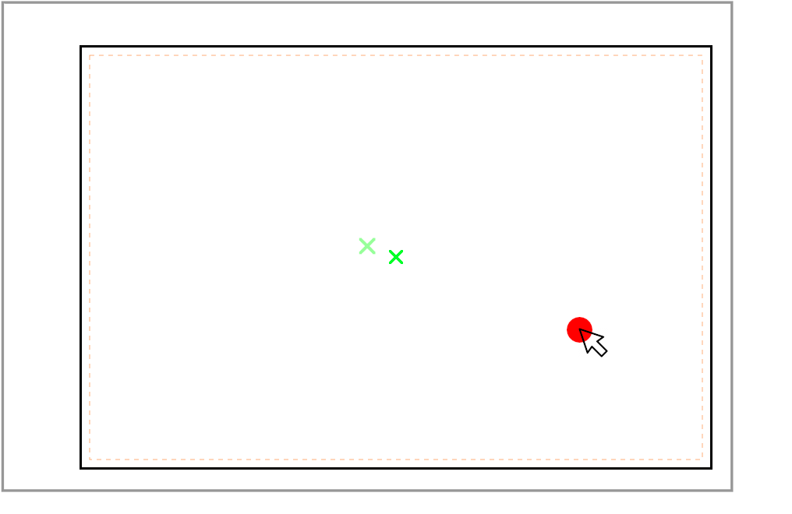

> This post is part of a series about [refactoring React components](https://jkettmann.com/tag/refactoring/)

The goal of this article is to help software developers write high-quality code. Even good, experienced engineers often have trouble with code-readability or don't emphasize it. At least this is what I experience almost whenever I jump on a new project as a contractor.

We will have a look at a real-world code example that is hard to read and understand. We will then refactor it to be much more well-structured and maintainable.

Mimicking a professional workflow will hopefully help more inexperienced developers to get a glimpse of feature development in bigger teams. We will therefore first create a user story and acceptance criteria, try to understand the details of the problem and only then start the refactoring.

## The original implementation

In one of my recent projects, we had a pannable and zoomable image component which was included in a much larger feature.

This feature was composed of a lot of big components with hundreds of lines of code which were buggy and very hard to maintain. Our team was required to fix these bugs... a near-impossible task. So we decided to start a rewrite.

The following component is similar to what we found before the rewrite. Although it was originally part of a much bigger chunk of code which I edited to be a good fit for this article.

```jsx
import React, { useEffect, useRef, useState } from 'react';
import './PanAndZoomImage.css';

const PanAndZoomImage = ({ src }) => {
  const [isPanning, setPanning] = useState(false);
  const [image, setImage] = useState();
  const [position, setPosition] = useState({
    oldX: 0,
    oldY: 0,
    x: 0,
    y: 0,
    z: 1,
  });

  const containerRef = useRef();

  const onLoad = (e) => {
    setImage({
      width: e.target.naturalWidth,
      height: e.target.naturalHeight,
    });
  };

  const onMouseDown = (e) => {
    e.preventDefault();
    setPanning(true);
    setPosition({
      ...position,
      oldX: e.clientX,
      oldY: e.clientY
    });
  };

  const onWheel = (e) => {
    if (e.deltaY) {
      const sign = Math.sign(e.deltaY) / 10;
      const scale = 1 - sign;
      const rect = containerRef.current.getBoundingClientRect();

      setPosition({
        ...position,
        x: position.x * scale - (rect.width / 2 - e.clientX + rect.x) * sign,
        y: position.y * scale - (image.height * rect.width / image.width / 2 - e.clientY + rect.y) * sign,
        z: position.z * scale,
      });
    }
  };

  useEffect(() => {
    const mouseup = () => {
      setPanning(false);
    };

    const mousemove = (event) => {
      if (isPanning) {
        setPosition({
          ...position,
          x: position.x + event.clientX - position.oldX,
          y: position.y + event.clientY - position.oldY,
          oldX: event.clientX,
          oldY: event.clientY,
        });
      }
    };

    window.addEventListener('mouseup', mouseup);
    window.addEventListener('mousemove', mousemove);

    return () => {
      window.removeEventListener('mouseup', mouseup);
      window.removeEventListener('mousemove', mousemove);
    };
  });

  return (
    <div
      className="PanAndZoomImage-container"
      ref={containerRef}
      onMouseDown={onMouseDown}
      onWheel={onWheel}
    >
      <div
        style={{
          transform: `translate(${position.x}px, ${position.y}px) scale(${position.z})`,
        }}
      >
        
      </div>
    </div>
  );
};
```

The component doesn't seem that huge or complicated. But when I first read the code it wasn't easy to understand what was going on. It might be easier to grasp when you see the working example. So run [this Codesandbox](https://codesandbox.io/s/github/jkettmann/jr-to-sr-refactoring-an-pan-and-zoom-image-component/tree/junior/?fontsize=14&amp;module=%2Fsrc%2FPanAndZoomImage%2FPanAndZoomImage.js) or [download the source from GitHub](https://github.com/jkettmann/jr-to-sr-refactoring-an-pan-and-zoom-image-component/tree/junior).

## What are the problems with this component?

The `PanAndZoomImage` component above is not terribly long (~100 lines). It also seems to be working fine. So what is wrong with it?

It's hard to understand what's going on. The readability of this code and thus its maintainability is quite bad. Mostly bad naming of variables and missing separation of functions are responsible.

Let's do a quick code review:

- `position` is actually not a position but tells us how many pixels we have to translate the image
- `position.z` is not representing the `z` coordinate but rather the zoom scale
- `position.oldX` is not related to the image "position" but the previous position of the mouse pointer inside the window
- `onWheel` is handling the zooming via the mouse wheel which makes sense but is not immediately obvious from the code
- the calculation inside `onWheel` is not easily understandable... at least not for me
- it's unclear why we use `window.addEventListener` for the `mousemove` and `mouseup` events
- ...

So how would we approach a rewrite of this component in a more senior way?

## Defining the problem

A common way to define the requirements for a feature like this in a professional environment is to write a ticket or user story for the problem. This is often done by a product owner.

> **As a** user
> **I want to** pan and zoom an image
> **so that** I can see different levels of detail

The implementation should work the same way as, for example, [Google Maps](https://www.google.com/maps). You can move the map with the mouse and zoom in and out via the mouse wheel or trackpad.

Let's add some acceptance criteria to the ticket to have more technical detail:

> **Acceptance Criteria:**
>
> - when clicking and dragging the image it moves with the mouse pointer
> - when moving the mouse wheel to the front (back) the image zooms in (out)
> - during a zoom the point of the image below the mouse cursor remains at its current position

Great! We now know what we want to achieve. The next step is to get an understanding of how a possible solution might look like.

## Understanding the solution

First, let's think about the first acceptance criterion: panning the image. That's rather simple.

Once the user clicks inside the image container (meaning `mousedown` event) we start panning. When they move the mouse (`mousemove` event) we need to translate the image in the same direction. But we only have access to the current mouse position via the event's `clientX` and `clientY` attributes. Thus we need to track the previous position and compare it to the current. Don't worry, this will become clear once you see the code.

The second acceptance criterion is simple as well. We just need to know in which direction the mouse wheel was moved. We can do that via the event's `deltaY` attribute. Then we apply a scale to the image.

The last criterion is a bit more difficult. If we just scale the image it will look like the image is moving below the mouse. An initial idea might be to use the CSS `transform-origin`. But the user can zoom at one position of the image, then move the mouse and zoom somewhere else again. In that case, the transform-origin would move as well.

Let's take a look at a visual representation of this acceptance criteria:



The inner orange dotted line is the image container with the class `PanAndZoomImage-container` in the JSX code. This container does not change its size or position.

The black rectangle is the initial image with the bright green x in its center. The grey rectangle with the lighter green x in its center is the image after zooming in.

The mouse pointer with the red dot is the scale origin. The point below it should remain in the same position. We achieve that by moving the picture by the distance between the centers of the image container and the scaled image (meaning the distance between the two green x).

Nice! Now it should be no problem to start writing code.

## The implementation

First, let's decide how to structure the component. Imagine being a new developer that reads the code for the first time.

The JSX of the original implementation seems fine so we leave it like is. What makes the code hard to read is the somewhat complex logic before the return statement. One way of abstracting away business logic in React is to move it to a custom hook. We will only create a single hook since the component's logic is interdependent.

> Note: When encapsulating logic into hooks you should always consider the single responsibility principle. In this case panning and zooming depend on each other so we create only one hook.

### The custom hook

We create a hook called `usePanAndZoom`. This contains the state handling and the required event handlers.

```jsx
import { useRef, useReducer } from 'react'
import reducer, { initialState } from './reducer'
import { pan, startPan, zoom } from './actions'

const usePanAndZoom = () => {
  const [state, dispatch] = useReducer(reducer, initialState);

  const containerRef = useRef(null);

  const onMouseMoveInWindow = (event) => {
    event.preventDefault();
    dispatch(pan(event));
  };

  const onMouseUpInWindow = () => {
    window.removeEventListener('mouseup', onMouseUpInWindow);
    window.removeEventListener('mousemove', onMouseMoveInWindow);
  };

  const onMouseDown = (event) => {
    dispatch(startPan(event));
    window.addEventListener('mouseup', onMouseUpInWindow);
    window.addEventListener('mousemove', onMouseMoveInWindow);
  }

  const onWheel = (event) => {
    if (event.deltaY !== 0 && containerRef.current) {
      const containerRect = containerRef.current.getBoundingClientRect();
      dispatch(zoom(event, containerRect));
    }
  }

  return {
    ...state,
    containerRef,
    onMouseDown,
    onWheel,
  }
}
```

`useReducer` is a good match for this use-case since we have one state which is accessed by multiple event handlers. We will define the reducer and actions in separate files. This way only the implementations of the event handlers remain in our custom hook.

One advantage of using the action creators `startPan`, `pan` and `zoom` is that we're very explicit about the responsibilities of each event handler:

- mouse down is triggering the start of panning
- mouse move updates the pan
- the wheel event changes the zoom level

A reader of this code will quickly see what's going on. Some people may claim that this code would be easier to read when everything was in one file. But abstracting away the implementation details comes with a great benefit:

Imagine you're a new developer who needs to fix a bug in the zoom implementation. You can read the file, quickly disregard everything related to panning, and only dig into the zoom action. If the file had much more content your brain would need to filter more unimportant things. You would end up spending more time until you found the bug.

Finally, the naming of the event handlers for mouse up and move are more explicit. `onMouseMoveInWindow` makes it clearer that the handler is listening to move events inside the complete window, not only the image container. The reason is that we want the panning to start only inside the image container, but moving and ending the pan should also be possible outside.

### The reducer

Now it's time to create the main business logic of our component which resides in the reducer used by our custom hook.

The reducer needs to handle the three actions for start panning, panning, and zooming.

```jsx
import { types } from './actions';

export const initialState = {
  translateX: 0,
  translateY: 0,
  prevMouseX: 0,
  prevMouseY: 0,
  scale: 1,
};

const reducer = (state, action) => {
  switch(action.type) {
    case types.PAN_START:
      return {
        ...state,
        prevMouseX: action.clientX,
        prevMouseY: action.clientY,
      };

    case types.PAN:
      const deltaMouseX = action.clientX - state.prevMouseX;
      const deltaMouseY = action.clientY - state.prevMouseY;
      return {
        ...state,
        translateX: state.translateX + deltaMouseX,
        translateY: state.translateY + deltaMouseY,
        prevMouseX: action.clientX,
        prevMouseY: action.clientY,
      };

    case types.ZOOM:
      const scaledTranslate = getScaledTranslate(state, action.zoomFactor);
      const mousePositionOnScreen = { x: action.clientX, y: action.clientY };
      const zoomOffset = getZoomOffset(action.containerRect, mousePositionOnScreen, action.zoomFactor);
      return {
        ...state,
        scale: state.scale * action.zoomFactor,
        translateX: scaledTranslate.x + zoomOffset.x,
        translateY: scaledTranslate.y + zoomOffset.y,
      };

    default:
      return state;
  }
};

const getZoomOffset = (containerRect, mousePositionOnScreen, zoomFactor) => {
  const zoomOrigin = {
    x: mousePositionOnScreen.x - containerRect.left,
    y: mousePositionOnScreen.y - containerRect.top,
  }

  const currentDistanceToCenter = {
    x: containerRect.width / 2 - zoomOrigin.x,
    y: containerRect.height / 2 - zoomOrigin.y,
  };

  const scaledDistanceToCenter = {
    x: currentDistanceToCenter.x * zoomFactor,
    y: currentDistanceToCenter.y * zoomFactor,
  }

  const zoomOffset = {
    x: currentDistanceToCenter.x - scaledDistanceToCenter.x,
    y: currentDistanceToCenter.y - scaledDistanceToCenter.y,
  };

  return zoomOffset;
};

const getScaledTranslate = (state, zoomFactor) => ({
  x: state.translateX * zoomFactor,
  y: state.translateY * zoomFactor,
});
```

As promised the implementation of the pan is rather simple. Again we're very explicit with naming variables like `deltaMouseX` inside the `PAN` case.

The zoom logic is more complicated. To improve readability we separated it into two functions called `getScaledTranslate` and `getZoomOffset`.

When a user first moves the image and then zooms in/out at any point we need to scale the previous translation vectors as well. This is what `getScaledTranslate` is used for.

`getZoomOffset` solves the third acceptance criteria (leaving the image below the mouse pointer in the same position). Since the naming of the variables is quite explicit it might be easier to read the code than following this explanation:

As described by the sketch we need to calculate the distance of the mouse pointer to the center of the container. The zoom offset is now the difference between this distance and its scaled version.

### The action creators

The implementation of the action creators used by our custom hook is straightforward. Important to note is the usage of the constant `ZOOM_FACTOR`.

If someone decided that the zoom steps were not big enough we could simply adjust this one constant and all would be done. This constant should be easy to find but we could still debate about a better place. The file for action creators might not be the perfect location.

```jsx
const ZOOM_FACTOR = 0.1;
const ZOOM_FACTOR_IN = 1 + ZOOM_FACTOR;
const ZOOM_FACTOR_OUT = 1 - ZOOM_FACTOR;

export const types = {
  PAN: 'PAN',
  PAN_START: 'PAN_START',
  ZOOM: 'ZOOM',
};

export const startPan = (event) => ({
  type: types.PAN_START,
  clientX: event.clientX,
  clientY: event.clientY,
});

export const pan = (event) => ({
  type: types.PAN,
  clientX: event.clientX,
  clientY: event.clientY,
});

export const zoom = (event, containerRect) => ({
  type: types.ZOOM,
  zoomFactor: event.deltaY < 0 ? ZOOM_FACTOR_IN : ZOOM_FACTOR_OUT,
  clientX: event.clientX,
  clientY: event.clientY,
  containerRect: containerRect,
});
```

### The component

We are now able to simplify the component quite a bit. The only thing that's left is our custom hook and the JSX code.

One nice improvement: we don't have the `onLoad` callback on the `img` element anymore. Saving the image size was redundant but hard to realize in the original implementation.

```jsx
import React from 'react';
import usePanAndZoom from './usePanAndZoom';
import './PanAndZoomImage.css';

const PanAndZoomImage = ({ src }) => {
  const {
    containerRef,
    onMouseDown,
    onWheel,
    translateX,
    translateY,
    scale,
  } = usePanAndZoom();

  return (
    <div
      className="Image-container"
      ref={containerRef}
      onMouseDown={onMouseDown}
      onWheel={onWheel}
    >
      <div
        style={{
          transform: `translate(${translateX}px, ${translateY}px) scale(${scale})`,
        }}
      >
        
      </div>
    </div>
  );
};
```

## Summary

We rewrote a not-too-complex but hard-to-read component into a well-structured and maintainable piece of code. A custom hook and a reducer helped us to abstract away the important but complex parts of the business logic. Separating the calculations into multiple well-named functions and variables will help new developers (and ourselves after some time) to understand our code.

I hope you liked this article. I'm planning to release more posts about refactorings or rewrites of complicated code. If you're interested sign up below. I'm also always interested in even cleaner solutions. Just leave a comment or send me a message on Twitter.

One last thing: I'm always looking for new code examples. If you have a component or some logic that you would like to refactor feel free to contact me.

import Newsletter from 'components/Newsletter'

<Newsletter formId="1499362:x4g7a4"/>