Every developer knows this situation: You're writing your code, hammering your keyboard all day long. Your code seems to work. Until it doesn't. Either it's not working as expected at all or only in some situations.

You try to find the problem. You have a close look at the code. But nothing seems wrong! So why the heck is this happening?

With time you will have found debugging strategies to deal with these kinds of problems. You will have some intuition that tells you where to look.

But for beginners, code that's not working can feel like a black hole. You don't know where to start. You're poking around and maybe, if you're lucky, you find a solution. But that can take hours or days.

At the beginning of my career, it was always great to learn by watching more experienced people doing their work. This is why I want to share the way I debugged a problem that another developer had in their project.

Be aware that debugging is not always a linear process. All roads lead to Rome. Some developers have a very logical step by step debugging process. Some are rather chaotic and jump around to find leads.

You can read this post like a protocol of the debugging process for this particular problem. I recommend you follow along step by step for better understanding. Simply [clone this repository](https://github.com/jkettmann/react-debugging-session-hundreds-of-function-calls) as a starting point.

import HighlightBox from 'components/HighlightBox';

<HighlightBox>
  If you like this post get a <a href="#post-subscribe">free cheatsheet</a> with lots of techniques for debugging React at the end of this post.
</HighlightBox>

## The issue

First of all, let's have a look at the application. It's a budgeting app that displays the expenses per category in a bar chart.

The component we need to investigate is the [BarChart](https://github.com/jkettmann/react-debugging-session-hundreds-of-function-calls/blob/master/src/BarChart.js) component.

```jsx
import React, { useEffect, useState } from "react";
import axios from "axios";
import { ResponsiveBar } from "@nivo/bar";

const theme = {
  axis: {
    ticks: {
      line: {
        stroke: "#e9ecee",
        strokeWidth: 40
      },
      text: {
        fill: "black",
        fontFamily: "BlinkMacSystemFont",
        fontSize: 16
      }
    }
  },
  grid: {
    line: {
      stroke: "#e9ecee",
      strokeWidth: 5
    }
  },
  legends: {
    text: {
      fontFamily: "BlinkMacSystemFont"
    }
  }
};

function BarChart() {
  const [data, setData] = useState([]);

  useEffect(() => {
    axios
      .get('http://localhost:8080/spendings')
      .then((response) => setData(response.data));
  }, []);

  const getDollarAmount = (bar) => {
    console.log('getDollarAmount');
    const amountInDollar = bar.value * bar.data.total_budget;
    return `$${parseFloat(amountInDollar).toFixed(2)}`;
  }

  return (
    <div className="chart" style={{ height: "500px" }}>
      <h4 className="chart-title">Budget Performance</h4>
      <ResponsiveBar
        markers={[
          {
            axis: "x",
            value: 1,
            lineStyle: { stroke: "rgba(0, 0, 0, .35)", strokeWidth: 2 },
            legend: "Goal",
            legendOrientation: "horizontal",
            legendPosition: "top"
          }
        ]}
        enableGridX={false}
        gridXValues={[1]}
        enableGridY={false}
        data={data}
        keys={["budget_status", "over_budget"]}
        indexBy="category"
        margin={{ top: 25, right: 130, bottom: 50, left: 125 }}
        padding={0.3}
        layout="horizontal"
        colors={{ scheme: "set2" }}
        theme={theme}
        borderColor={{ from: "color", modifiers: [["darker", 1.6]] }}
        axisBottom={null}
        label={getDollarAmount}
        isInteractive={false}
      />
    </div>
  );
}

export default BarChart;
```

The `BarChart` component fetches data from a development server when it did mount. It saves the data to a state and renders it in a bar chart. This is what it looks like.

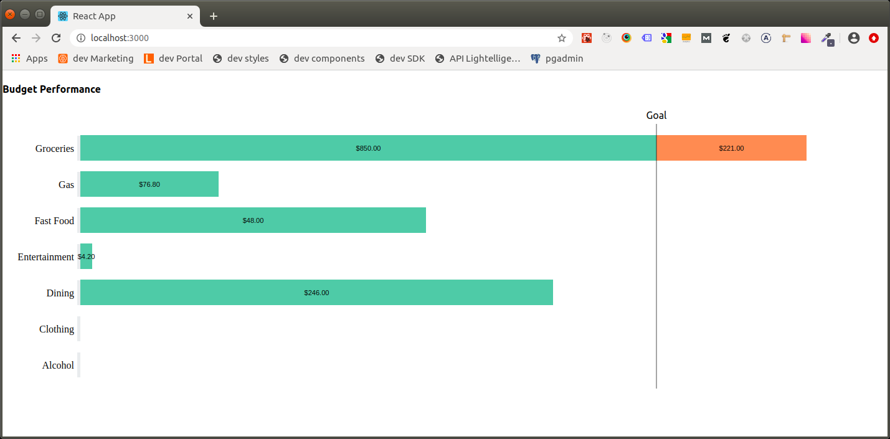

So what is the problem here? Seems to work all fine.

When you open the console in your Browser's dev tools you will see a lot of log statements from the `getDollarAmount` function. There are hundreds of them.

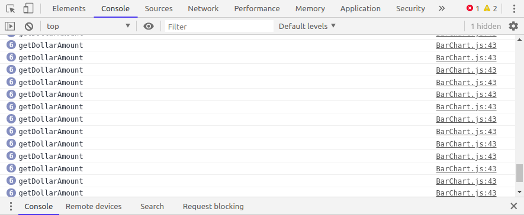

Something seems to be wrong. So let's start debugging!

## Pinpointing the issue

First of all, let's try to pinpoint the problem. One possibility is that the component is rendered hundreds of times for some reason. Another reason might be that something inside the `BarChart` component is triggering this amount of calls to the `getDollarAmount` function.

Considering the possibility of unnecessary renders we should have a look at the parent component. This is the `Dashboard` component.

```jsx
import React, { useState, useEffect } from 'react';
import Axios from 'axios';
import BarChart from './BarChart';

function Dashboard() {
  const [isLoading, setLoading] = useState(true);
  const [widgets, setWidgets] = useState([]);

  useEffect(() => {
    Axios
      .get('http://localhost:8080/widgets')
      .then((response) => setWidgets(response.data))
      .finally(() => setLoading(false));
  }, []);

  if (isLoading) {
    return <div>Loading...</div>;
  }

  return (
    <div>
      {widgets.includes('BarChart') && <BarChart />}
    </div>
  );
}

export default Dashboard;
```

It fetches some widgets from our development server while it's rendering a loading state. Once the data has arrived we render the `BarChart` component if it's included in the widget list.

Fair enough, I can't see any reason for a huge amount of re-rendering. But to be sure let's try to check the render function of the `BarChart` component anyway.

Our first option would be to set a breakpoint inside the `BarChart` component. This is usually the best way to see why a function is called and what its arguments are. But for render functions or asynchronous code, I mostly prefer `console.log` statements.

Thus the first step is to add a log statement to the `BarChart` component.

```jsx
function BarChart() {
  console.log('render BarChart');
  const [data, setData] = useState([]);

  ...
}
```

Since we're at it already let's see where `getDollarAmount` is called. The only place seems to be the label prop of the `ResponsiveBar` component.

Let's add a log statement there as well.

```jsx
function BarChart() {
  ...

  return (
    <div>
      <h4>...</h4>
      <ResponsiveBar
        ...
        label={d => console.log('label called') || getDollarAmount(d)}
      />
    </div>
  )
}
```

> Note: Using the `||` operator to add a log statement to a function prop is a great way to get around adding curly brackets.

To clean the console output a bit we remove the log statement from `getDollarAmount`. Let's see what happens now:

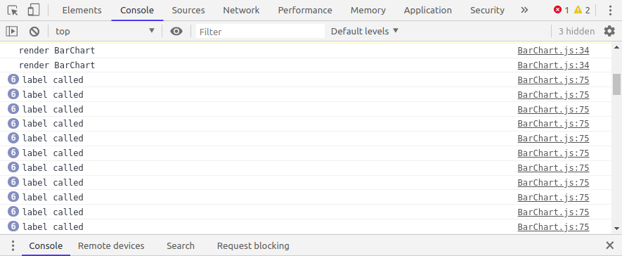

Clearly, the label prop is the winner. Why the heck is that?

## Taking a detour

The author of this code mentioned that fetching the data inside the `useEffect` causes the problem. The code inside `useEffect` is executed once the component did mount. Thus it's equivalent to fetching data inside a class component's `componentDidMount` function.

Why should this be the problem? Sounds strange enough to be investigated, right? So let's remove the asynchronous `axios` call and set some mock data to the state immediately after the component did mount. We can simply take the mock data from [the development server](https://github.com/jkettmann/react-debugging-session-hundreds-of-function-calls/blob/master/server/index.js).

```jsx
function BarChart() {
  const [data, setData] = useState([]);

  useEffect(() => {
    const response = {
      data: [
        {
          category: "Alcohol",
          budget_status: 0.0,
          over_budget: 0.0,
          total_budget: 180,
        },
        {
          category: "Clothing",
          budget_status: 0.0,
          over_budget: 0.0,
          total_budget: 200,
        },
        {
          category: "Dining",
          budget_status: 0.82,
          over_budget: 0.0,
          total_budget: 300,
        },
        {
          category: "Entertainment",
          budget_status: 0.02,
          over_budget: 0.0,
          total_budget: 210,
        },
        {
          category: "Fast Food",
          budget_status: 0.6,
          over_budget: 0.0,
          total_budget: 80,
        },
        {
          category: "Gas",
          budget_status: 0.24,
          over_budget: 0.0,
          total_budget: 320,
        },
        {
          category: "Groceries",
          budget_status: 1.0,
          over_budget: 0.26,
          total_budget: 850,
        }
      ]
    };
    setData(response.data);
  }, []);

  ...
}
```

Indeed, this fixes the problem as you can see here. There are only a couple of log statements *label called* left.

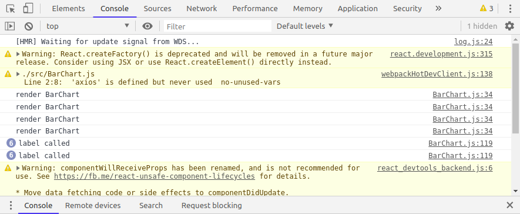

Interesting! But why is that? What effect did our change have?

Removing the API request causes `setState` to be called immediately when the component did mount. It's not moved to the task queue and executed during a later event loop anymore.

No idea how this is related to the problem though... but is the async call really causing it? We can test this either using `setTimeout` or `Promise.resolve`.

```jsx
function BarChart() {
  const [data, setData] = useState([]);

  useEffect(() => {
    const response = { ... };
    Promise.resolve().then(() => setData(response.data));
  }, []);

  ...
}
```

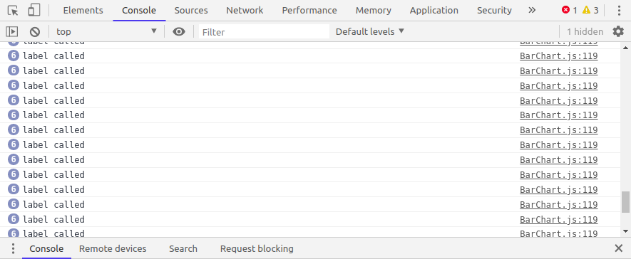

Calling `setData` async really seems to cause the problem. That's confusing!

## Taking a step back

It's not obvious what difference it should make whether we set the state directly or after a short delay. So let's take a step back and have another look at the `BarChart` component.

```jsx
function BarChart() {
  const [data, setData] = useState([]);

  useEffect(() => {
    axios
      .get('http://localhost:8080/spendings')
      .then((response) => setData(response.data));
  }, []);

  const getDollarAmount = (bar) => {
    console.log('getDollarAmount');
    const amountInDollar = bar.value * bar.data.total_budget;
    return `$${parseFloat(amountInDollar).toFixed(2)}`;
  }

  return (
    <div className="chart" style={{ height: "500px" }}>
      <h4 className="chart-title">Budget Performance</h4>
      <ResponsiveBar
        markers={[
          {
            axis: "x",
            value: 1,
            lineStyle: { stroke: "rgba(0, 0, 0, .35)", strokeWidth: 2 },
            legend: "Goal",
            legendOrientation: "horizontal",
            legendPosition: "top"
          }
        ]}
        enableGridX={false}
        gridXValues={[1]}
        enableGridY={false}
        data={data}
        keys={["budget_status", "over_budget"]}
        indexBy="category"
        margin={{ top: 25, right: 130, bottom: 50, left: 125 }}
        padding={0.3}
        layout="horizontal"
        colors={{ scheme: "set2" }}
        theme={theme}
        borderColor={{ from: "color", modifiers: [["darker", 1.6]] }}
        axisBottom={null}
        label={getDollarAmount}
        isInteractive={false}
      />
    </div>
  );
}
```

We know that the `getDollarAmount` function is called by the `ResponsiveBar` label prop. What again was the ResponsiveBar component?

```jsx
import { ResponsiveBar } from "@nivo/bar";
```

Okay, now it gets messy. The problem might be inside a third-party library. The component is imported from a third-party library called [nivo](https://github.com/plouc/nivo/tree/v0.61.2). Never heard of it. Seems to help you with rendering data...

## Investigating a third-party library's source code

When debugging npm packages you have two options: investigate the source code or try to debug on your local machine.

Investigating the source code seems easier for now. So where do we find the `ResponsiveBar`?

When you follow the link to the nivo package in the last section you will see this.

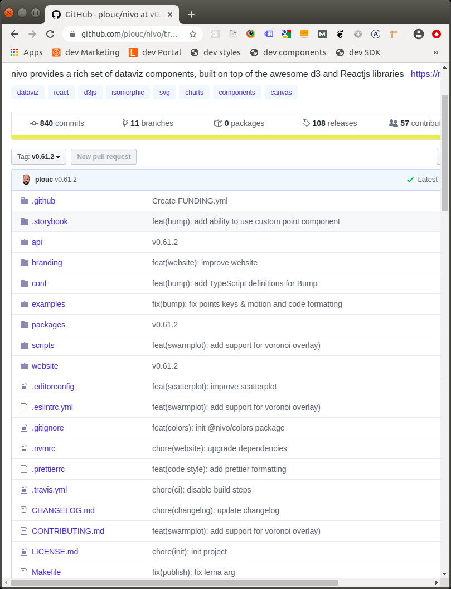

As a beginner, it's sometimes hard to find the source. With a bit of experience, this becomes easier though.

The `packages` folder seems most promising. When you open it you'll see a `bar` folder that again contains a `src` folder. Voila, there is the `ResponsiveBar`. Once you open it you'll see that it renders the `Bar` component inside a `ResponsiveWrapper`.

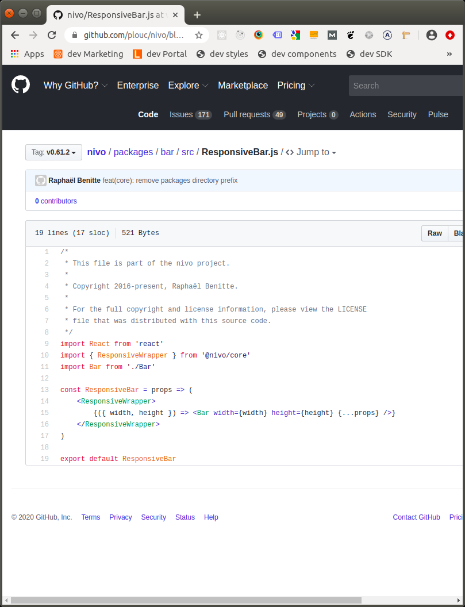

For now, let's focus on the [Bar component](https://github.com/plouc/nivo/blob/v0.61.2/packages/bar/src/Bar.js).

Since we know that the `label` prop is responsible for the calls to `getDollarAmount` we'll search for "label" inside this file.

After looking around a bit it turns out there are two places where we have a label prop in the child components. [One is rendered](https://github.com/plouc/nivo/blob/v0.61.2/packages/bar/src/Bar.js#L214) when the `animate` flag is `true`, [the other](https://github.com/plouc/nivo/blob/v0.61.2/packages/bar/src/Bar.js#L230) when it's false.

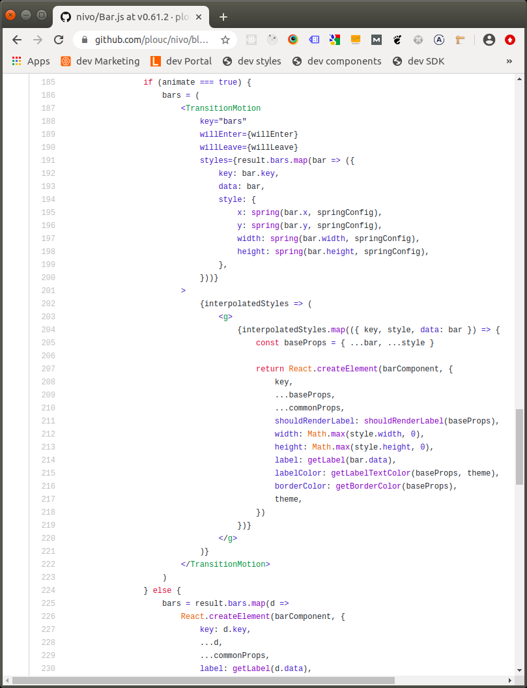

Interestingly the name of the function that is called is not `label` but `getLabel`. We'll assume for now that the `label` prop we pass to `ResponsiveBar` component is somehow the same.

## Debugging third-party libraries

By now we found out that the nivo `ResponsiveBar` component is responsible for the hundreds of calls of our `getDollarAmount` function. We also found out that the component accepts an `animate` prop (we might have known that by reading the docs as well...).

Now that we have a rough picture of how the `ResponsiveBar` works we can start debugging the `nivo` package on our machine. But how does that work?

The source code of all the packages that we use lives inside the `node_modules` folder.

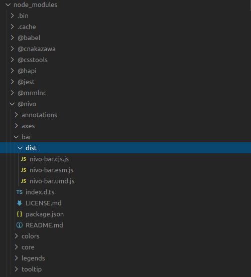

Inside the `node_modules -> @nivo -> bar -> dist` directory we can see three files, `cjs`, `esm`, and `umd`.

I probably should know better but I never remember which of those is used. How to find out? Simply open up every file, add a `log` statement to the `Bar` and see what happens.

So we open the `nivo-bar.esm.js` and see this:

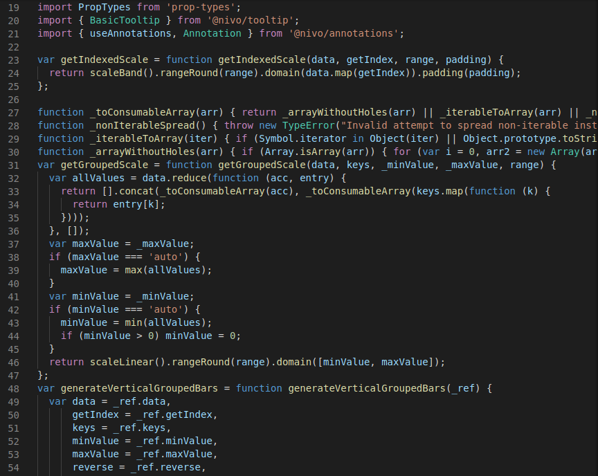

Looks complicated! And there's a lot of code! That's because it's compiled.

We can be smart though and use the editor's search function. We know the name of the component we're interested in is `Bar`.

So let's search for `function Bar` with case matching. We get 4 results and the third one is a hit:

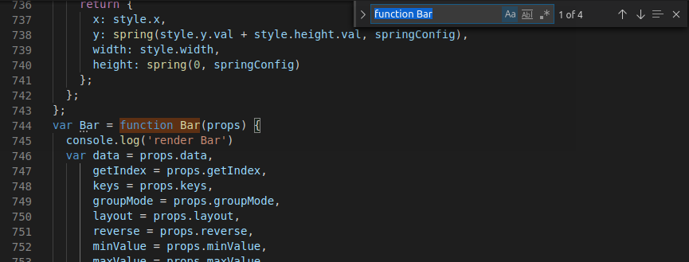

We add a log statement and save the file. Unfortunately, we have to realize that hot module reloading doesn't work.

That makes sense since webpack is probably not listening to `node_modules`. Let's give it another shot, open our `BarChart` component and save it. The React app refreshes but unfortunately no output in the console from any `nivo-bar` file.

Wait a second... I guess there's a better idea: Why not add a breakpoint to the `getDollarAmount` function in our browser's dev tools. We should be able to trace the calling function back using the call stack.

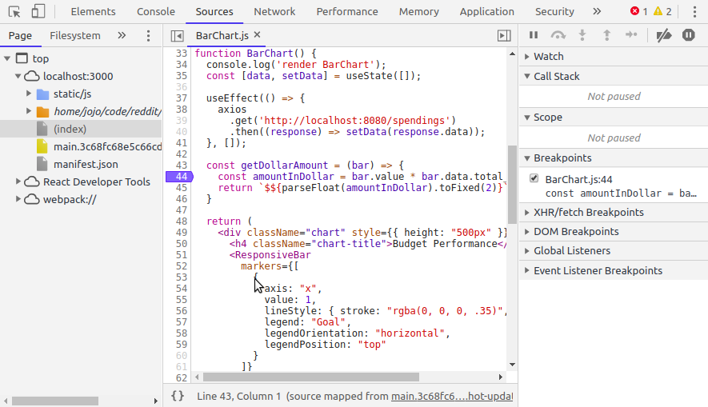

Now we can refresh the app and see what happens. The execution stops as expected at the breakpoint.

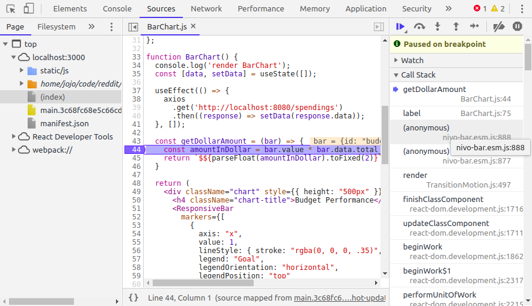

Great! Now we can see that the file we need to investigate is `nivo-bar.esm.js`. Let's click the first occurrence of that file on the call stack to see which line is responsible for calling our `getDollarAmount` function.

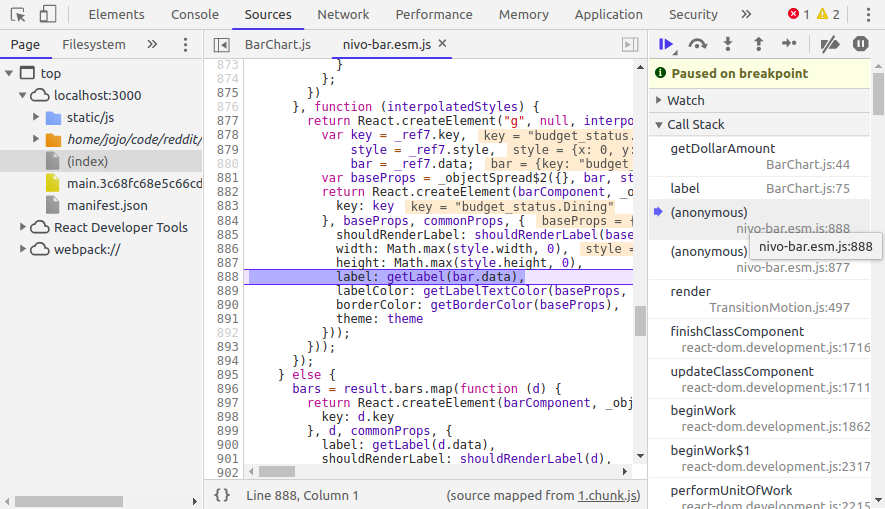

Makes sense. It's one of the label props that calls `getLabel`. More specifically it's the one that's called when the `animate` flag is `true`.

Next, we want to confirm that this is the code that's responsible for all the calls to `getDollarAmount`. One way to do that is to add a log statement at the right place inside `nivo-bar.esm.js`.

To find this place we select a piece of code that looks somewhat unique inside the dev tools. This line looks like a good candidate.

```jsx
}, function (interpolatedStyles) {
```

We head back to our editor and open `nivo-bar.esm.js`. We enter the above line in the search.

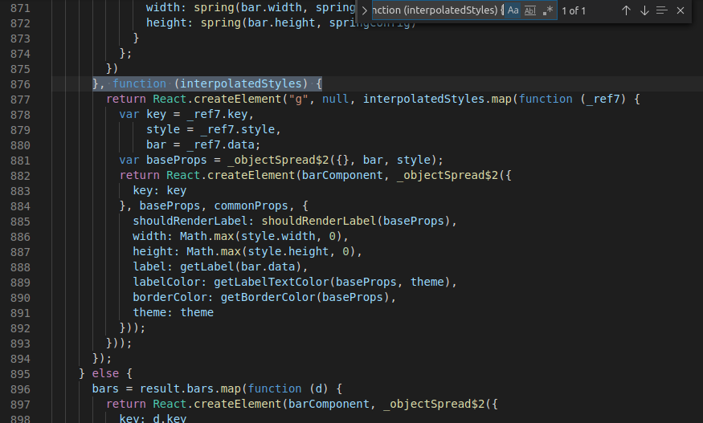

Great! There is our `getLabel` call. Now let's add a hopefully final log statement just before the bar component is rendered.

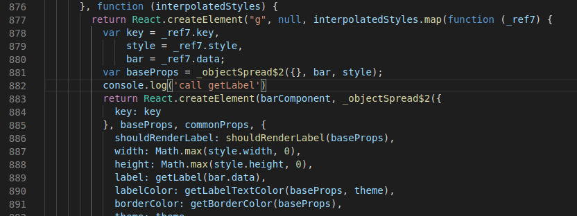

We remove all previous log statements. We also remove the breakpoint inside `getDollarAmount` and add the log statement that we had there initially. We know already that hot module reloading is not working so we restart the app.

Now we open the browser and finally see the console output we were hoping for. Before every call of `getDollarAmount` the component that has the `getLabel` prop is rendered.

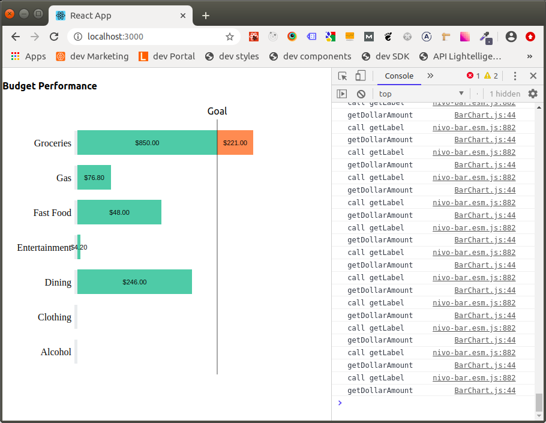

The hundreds of calls to `getDollarAmount` clearly are coming from the nivo `Bar` component.

## What about the `animate` prop?

There is one last thing we might want to check. The `animate` prop of the `ResponsiveBar` component. What happens when we set it to `false`?

```jsx
function BarChart() {
  ...

  return (
    <div>
      <h4>...</h4>
      <ResponsiveBar
        ...
        animate={false}
      />
    </div>
  );
}
```

Heading back to the browser gives us this console output.

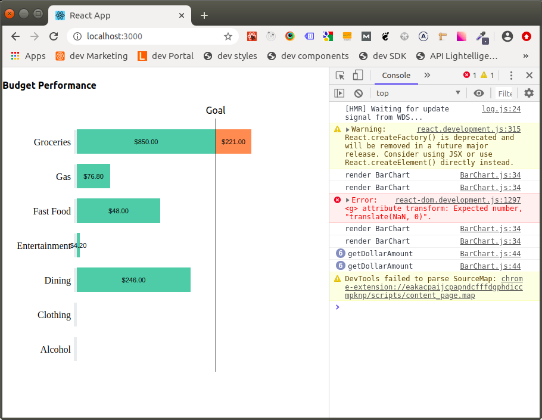

It works! Only a couple of calls to `getDollarAmount` left.

## Solving the mystery

We're really close to solving the mystery. Let's quickly recap.

1. The problem is related to an asynchronous call to `setState` in our `BarChart` component
2. The code that is responsible for the calls is inside the nivo `Bar` component, a third-party library
3. When we disable animation the problem seems to be solved

How does this all fit together? Let's have another close look at the source code of the [nivo Bar component](https://github.com/plouc/nivo/blob/v0.61.2/packages/bar/src/Bar.js#L187).

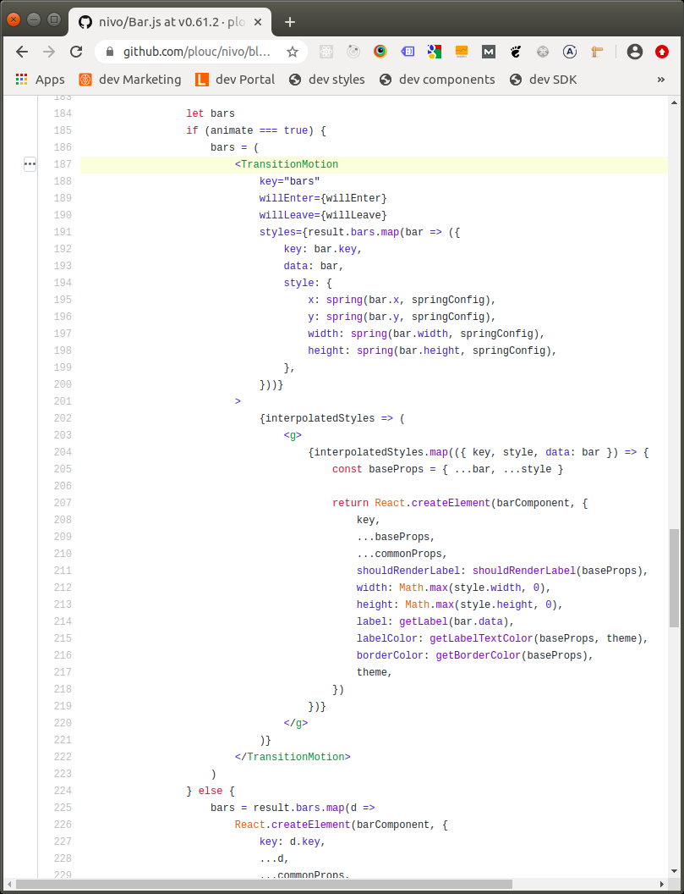

We can see that the element we were investigating before with our log statement in this line

```jsx
return React.createElement(barComponent, {
```

is wrapped inside a component called `TransitionMotion` which accepts a render prop as children.

What is this component? When we have a look at the top of the file we can see where it's imported from.

```jsx
import { TransitionMotion, spring } from 'react-motion'
```

An npm package called [react-motion](https://github.com/chenglou/react-motion). If you don't know this library have a look.

**The `TransitionMotion` component is responsible for the animation. It calls it's children repeatedly to update their position!**

Now the hundreds of calls make sense! We're animating a couple of bars. If the position of every bar is updated 50 times or so during an animation, we can explain the number of calls. This is a realistic number.

Ok, that solves why there are just a couple of calls to `getDollarAmount` when the animation is disabled in the `ResponsiveBar` component.

But what about the first point of the list above? Why is this only happening when we set our state asynchronously?

Our initial data inside the state is an empty array.

```jsx
function BarChart() {
  const [data, setData] = useState([]);
```

Thus there are no values to be rendered inside the bar. It's probably safe to assume that the default value for the `Bar` component is 0 in this case.

After the component did mount we fetch the data and update the state. This means that there is a certain period when the bar values are 0. The real data is set after the API responds.

Now it makes sense that we see an animation. The position of the bars has to be updated from 0 to their final values.

In contrast, when we set the mock data to the state immediately the bar values are already available at the first render of the `Bar` component. There's nothing to animate. Thus we only have a couple of calls to `getDollarAmount`.

## Wrapping it up

I hope this example of how I debug a React app has been helpful to you. Here are some of the techniques that we saw.

1. Analyzing the code
2. Debugging re-rendering issues with log statements
3. Debugging problems caused by API calls through mock data
4. Investigating third-party source code
5. Using breakpoints to find the origin of a function call
6. Debugging third-party libraries inside `node_modules`

import Newsletter from 'components/Newsletter'

<Newsletter formId="1882066:p9t3m2"/>