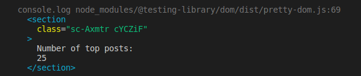

import Newsletter from 'components/Newsletter'

Most developers know it: Automated testing is important. There are many reasons arguing for it.

- You might unknowingly break an app whenever you change a line of code.
- Manually testing your app after each change is cumbersome.
- Tests help document edge cases.
- Aspiring developers can get a [competitive advantage](https://jkettmann.com/number-1-tip-for-outstanding-portfolio-projects/) over other job candidates.

Unfortunately, writing tests can be a real struggle for beginners. It's like developing in a completely new environment. You may not know what to test. You might spend hours to write a simple test case because you hit error after error. You're used to developing in the browser and it's great dev tools. But testing just doesn't work the same way.

It doesn't have to be that difficult though. With the right approach, you can start writing tests with confidence even as a beginner.

The goal of this blog post is to act as a guide for your first tests and provide React Testing Library examples. We'll take a small application and cover it with tests. We will discuss what we should test and why we should test it. We will see different techniques that can help us to write tests with confidence without relying on trial and error.

Since this is a pretty long in-depth blog post here is a table of contents so you know what to expect 😀

1. [The purpose of testing React apps](#the-purpose-of-testing-react-apps)
2. [React Testing Library vs Enzyme vs Jest](#react-testing-library-vs-enzyme-vs-jest)
3. [The application to test](#the-application-to-test)
4. [What should we test?](#what-should-we-test)
5. [Writing the tests](#writing-the-tests)
6. [Use React Testing Library's debug function instead of taking a stab in the dark](#use-react-testing-librarys-debug-function-instead-of-taking-a-stab-in-the-dark)
7. [How to access the rendered DOM tree](#how-to-access-the-rendered-dom-tree)
8. [Interacting with DOM elements](#interacting-with-dom-elements)
9. [Test if the correct page was rendered](#test-if-the-correct-page-was-rendered)
10. [Testing the form](#testing-the-form)
11. [Prevent duplication with a setup function](#prevent-duplication-with-a-setup-function)
12. [Changing and submitting the form](#changing-and-submitting-the-form)
13. [Accessing an element without ARIA role](#accessing-an-element-without-aria-role)
14. [Waiting for the data](#waiting-for-the-data)
15. [Mocking API requests](#mocking-api-requests)
16. [Testing mock functions](#testing-mock-functions)

> This post contains a lot of information. To help you remember all the details I ceated a **one-page React Testing Library cheat sheet with all the tips (+ more) and a list of resources** that you can get [at the end of this post](#subscribe-form).

Before we have a look at the application let's start with a broader look at testing React apps in general.

## The purpose of testing React apps

When you work on a larger application it can be terrifying to touch code related to its important parts. You might break crucial features with every small change. To minimize this risk developers write tests.

**The purpose of testing is to give you confidence that the app is working correctly.** If all the important use-cases are covered with tests you will quickly get feedback if you broke something.

I can't stress enough how big of a benefit this is for developers as well as businesses.

## React Testing Library vs Enzyme vs Jest

The go-to libraries for automated testing with React are currently _Jest_ in combination with _@testing-library/react_ (aka React Testing Library).

There are other React testing frameworks and libraries out there. Jest replaces libraries like Mocha, Jasmine, or AVA. _React Testing Library_ is used on top of Jest and is an alternative to Enzyme which many developers used (and still use) heavily.

_React Testing Library_ approaches testing from a user perspective. Thus it naturally leads to writing [integration tests](https://kentcdodds.com/blog/write-tests) where multiple components are tested together.

As an example, imagine a button. With _React Testing Library_ you typically wouldn't test if the `onClick` prop is called when the button is clicked. You would rather test if a specific button triggers a certain effect. Like a delete button opening a confirmation modal.

With Enzyme in contrast you would test implementation details like the click handler being called or a state variable being updated correctly. This leads to very detailed tests that break easily when you change something unrelated to the overall functionality (e.g. renaming the click handler or state variable).

## The application to test


> This app is a simplified version of a project we build in my course at [ooloo.io](https://ooloo.io). If you don't feel job-ready, you can learn here how professional teams develop real-world projects.

The app allows a user to find the top posts for a subreddit. It is a pretty simple app that just contains a header with a couple of links and a form. But it's a good starting point for your first tests.

The links in the header direct to other pages that are more of a placeholder only containing a headline. The important part is the navigation to another page.

The form contains a single text input where the user can enter the name of a subreddit.

Once they click the submit button a request is sent to the Reddit API. While the app is waiting for the response a loading state is displayed. As soon as the data has arrived it is rendered, in this case only the number of top posts for simplicity.

You can find the complete code in [this repository](https://github.com/jkettmann/beginners-guide-to-testing-react). If you like, clone it and follow along.

## What should we test?

The first question that may arise is what we should test. Let's take the form as an example. Here is how the component looks like:

```jsx
function Form({ onSearch }) {
  const [subreddit, setSubreddit] = useState('javascript');

  const onSubmit = (event) => {
    event.preventDefault();
    onSearch(subreddit);
  };

  return (
    <FormContainer onSubmit={onSubmit}>
      <Label>
        r /
        <Input type="text" name="subreddit" value={subreddit} onChange={(event) => setSubreddit(event.target.value)} />
      </Label>

      <Button type="submit">Search</Button>
    </FormContainer>
  );
}
```

The form keeps track of its input value with a state variable. When clicking the submit button it calls the `onSearch` prop which is given by the parent component.

You might also be interested in how the data is fetched. This is happening in the home page component which is the parent of the form.

```jsx
function Home() {
  const [posts, setPosts] = useState([]);
  const [status, setStatus] = useState('idle');

  const onSearch = async (subreddit) => {
    setStatus('loading');
    const url = `https://www.reddit.com/r/${subreddit}/top.json`;
    const response = await fetch(url);
    const { data } = await response.json();
    setPosts(data.children);
    setStatus('resolved');
  };

  return (
    <Container>
      <Section>
        <Headline>Find the best time for a subreddit</Headline>

        <Form onSearch={onSearch} />
      </Section>

      {status === 'loading' && <Status>Is loading</Status>}
      {status === 'resolved' && <TopPosts>Number of top posts: {posts.length}</TopPosts>}
    </Container>
  );
}
```

The home page component stores the API response inside a state variable and keeps track of its loading state. When a search is triggered by the form a request is sent to the Reddit API. Once the data arrives both state variables are updated and the result is rendered below the form.

Now that you have an overview of the important parts of the code **try to answer the question yourself before reading on: How would you test these two components?**

---

Our first impulse might be to have a look at the components above and start writing unit tests. We might want to test if the state is set correctly or if the Form component's `onSearch` prop is called with the current subreddit value. This is what many developers used to do with Enzyme.

But with _React Testing Library_ we don't have access to the state. We could still test the props, but we can't test whether or not the state variables hold the correct value.

**This is not a weakness, it's a strength.** State management is an implementation detail of a component. We could move the form state to its parent and the app would still work the same.

In fact [React itself is an implementation detail](https://kentcdodds.com/blog/react-is-an-implementation-detail). We could migrate the whole app to Vue.js without the user realizing it.

Instead of focussing on the code and how it works **we simply take the perspective of the user. This forces us to focus on testing the important parts of the application.**

Once we embrace this philosophy testing is not so mysterious and scary anymore.

> Note: A user can be the end-user of the application but it can also be another developer who uses a component you developed. Let's say you implemented an image gallery that's used by other developers of your team. You should test that it behaves correctly when props change for example.

Okay, user perspective it is. So let's forget about the components for a bit and focus on the user-facing part of the application. What is important for the app to function correctly for the user?


Just click through the app. That's basically it. We already described it above:

1. The user enters a value in the form's input and submits.
2. The app shows a loading message while it's waiting for the data.
3. When the response arrives the data is rendered.

The user doesn't care if the Home page or the Form component stores the input value. It doesn't matter whether or not the posts are stored in a state variable and what the data structure is. The only things that matter to the user are the three steps above.

Of course, we should test the links in the header as well. After all, a broken link (e.g. to the signup page) can be devastating for a business.

> Note: Usually we should also test edge cases and error handling of the form. But that would be too much for this blog post.

## Writing the tests

Let's quickly recap the last section and translate the findings into technical language:

We will write two test suites. One for the header links and one for the form. For the header, we need to test that the links are pointing to the correct target. For the form, we should test changing and submitting the form, the loading state, and the rendered response.

Let's start with the test suite for the header. First, we open the file `src/App.test.js` and remove the existing test. Now, we define the header test suite with a Jest [describe(...)](https://jestjs.io/docs/en/api#describename-fn) statement.

> Note: it's not necessary to wrap the tests with `describe` but it allows us to group related tests. In my opinion, this makes the terminal output easier to read, prevents repetitive test messages, and allows us to hide blocks of tests in our editor by folding.

```jsx
describe('Header', () => {});
```

The test cases are defined with `test(...)`. Alternatively, you can use `it(...)`. Both are provided by Jest.

```jsx
describe('Header', () => {
  test('"How it works" link points to the correct page', () => {});
});
```

We don't want to test the Header component in isolation but rather in the context of the application. That's why we should use the App component for this test.

Here is how it looks like:

```jsx
import React from 'react';
import { Switch, Route } from 'react-router-dom';
import GlobalStyle from './GlobalStyle';
import Header from './components/Header';
import Home from './pages/Home';

function App() {
  return (
    <>
      <GlobalStyle />
      <Header />

      <main>
        <Switch>
          <Route path="/how-it-works">
            <h1>How it works</h1>
          </Route>
          <Route path="/about">
            <h1>About</h1>
          </Route>
          <Route path="/">
            <Home />
          </Route>
        </Switch>
      </main>
    </>
  );
}
```

The App component uses React Router like many production applications. It renders the header and a couple of routes one of which is the home page.

Note that there's no Router here. For testing purposes, it is rendered outside of App in the application's `index.js` file. [During tests we wrap the App inside a MemoryRouter](https://reacttraining.com/react-router/web/guides/testing).

So as a first step, we render the App component. _React Testing Library_ provides a `render` function that creates the DOM for a given component.

```jsx
import { render } from '@testing-library/react';
import App from './App';

describe('Header', () => {
  test('"How it works" link points to the correct page', () => {
    render(
      <MemoryRouter>
        <App />
      </MemoryRouter>
    );
  });
});
```

Since the app was created with create-react-app everything necessary for using _React Testing Library_ is already installed and set up by default.

## Use React Testing Library's debug function instead of taking a stab in the dark

When you start writing tests you might feel like you're working with a black box. You don't understand what's happening. You're used to working with a browser where you can just open the dev tools to investigate the DOM tree.

When you start writing tests you need to get used to a new environment. You need a way to understand what's going on. What do you do when a test fails because an element wasn't found and you don't understand why?

That's where React Testing Library's `debug` function comes in very handy. It allows you to print the DOM tree at any given time. It's not as comfortable and interactive as the browser dev tools but it can help you get a clear picture of what's happening.

As you're starting out to write tests don't rely on trial and error. Rather take the time and use the `debug` function after each step you take.

So just to get a clear picture of what is going on in our test let's use the `debug` function.

```jsx
import { render, screen } from '@testing-library/react';

describe('Header', () => {
  test('"How it works" link points to the correct page', () => {
    render(
      <MemoryRouter>
        <App />
      </MemoryRouter>
    );
    screen.debug();
  });
});
```

When you run the tests with `yarn test` you should see the following output.


Great, we can see the header that contains a couple of links, including the "How it works" link we want to test. Now we just need to know how to access and interact with it.

## How to access the rendered DOM tree

[The preferred way](https://kentcdodds.com/blog/common-mistakes-with-react-testing-library/#not-using-screen) to access rendered elements is via the _screen_ object which is exported from _React Testing Library_.

The screen object provides a variety of queries, which are functions to access the DOM. Here are some examples:

- **getBy\*** queries like _getByTestId_, _getByText_, or _getByRole_: These functions are synchronous and check if an element is currently inside the DOM. If not they throw an error.
- **findBy\*** queries like _findByText_: These functions are asynchronous. They wait for a certain time (5 seconds by default) until an element appears in the DOM. If it doesn't they throw an error.
- **queryBy\*** queries: These functions are synchronous like \*getBy\*\*, but they don't fail when an element is not present. They just return `null`.

These are already a lot of options to pick from. And it's not even [the complete list](https://testing-library.com/docs/dom-testing-library/api-queries). Which one should we use to access the "How it works" link?

We know already that the header is always present. We don't need to wait for it to appear. That narrows our options down to a `getBy*` query. But which one should we choose?

At first glance `getByTestId` seems like a good choice. We only need to add test IDs to the elements we want to cover like this:

```jsx
<div data-testid="some-content">Some content</div>
```

Now we could access the `div` via `getByTestId('some-content')`. Very simple, right?

But obviously this means we change our code just to make it pass a test by adding the test IDs. That's not ideal. So are there better options?

Testing Library's documentation is great and worth a read. It in fact contains a [document that describes which query to use preferrably](https://testing-library.com/docs/guide-which-query).

Queries accessible to everyone have the highest priority. And among them, the `getByRole` should be the go-to query. Queries like `getByAltText` or `getByTitle` should only be used in exceptions. And the lowest priority has `getByTestId`. **You should use test IDs only when there's no other query you can use.**

Great, so let's give `getByRole` a try. The first parameter should be the [ARIA role](https://developer.mozilla.org/en-US/docs/Web/Accessibility/ARIA/ARIA_Techniques#Roles) of the element. Here we can use _link_. Since we have more than one link on the page we need to further specify the element by using the `name` option.

```jsx
render(
  <MemoryRouter>
    <App />
  </MemoryRouter>
);

const link = screen.getByRole('link', { name: /how it works/i });
```

Note that we used a regular expression `/how it works/i` instead of a string `'How it works'`. This way we can prevent problems with case-sensitivity (e.g. when using CSS _text-transformation_). We can also target partial strings. `/how it/i` would pass, `'How it'` wouldn't.

Save the file and the tests should automatically re-run and pass. This means that we found the link!

Since we're just starting out it's a good idea to double-check that everything works as expected. Remember the `debug` function? Many developers don't know that it takes a parameter. This way you can output a single element to the console.

```jsx
const link = screen.getByRole('link', { name: /how it works/i });
screen.debug(link);
```

This is what you should see in the terminal: The "How it works" link. Exactly what we expected.


## Interacting with DOM elements

By now we know how to access DOM elements. In particular the "How it works" link. But that's not enough. Remember what we wanted to test?

**The link should direct to the correct page.**

To make a link direct us to its target, we need to click it. With Testing Library we have two options:

1. Use the `fireEvent.click` function that is exposed by `@testing-library/react`
2. Use the `click` function that is exposed by `@testing-library/user-event`

[It's recommended](https://kentcdodds.com/blog/common-mistakes-with-react-testing-library/#not-using-testing-libraryuser-event) that we use `@testing-library/user-event` where possible. It contains more events (e.g. double click) that are closer to real user events.

And surprise: When you have a look at `package.json` you realize that it's installed by default when using create-react-app.

So let's click the link.

```jsx
import React from 'react';
import { render, screen } from '@testing-library/react';
import userEvent from '@testing-library/user-event';
import App from './App';

describe('Header', () => {
  test('"How it works" link points to the correct page', () => {
    render(
      <MemoryRouter>
        <App />
      </MemoryRouter>
    );
    const link = screen.getByRole('link', { name: /how it works/i });
    userEvent.click(link);
  });
});
```

## Test if the correct page was rendered

Next, we need to check if the user is sent to the correct page.

One way we could test this is by checking the URL. This is possible as described in the [react-router documentation](https://reacttraining.com/react-router/web/guides/testing/checking-location-in-tests). But the user doesn't really care about the URL, do they? After all, the URL might be correct but the app can show a 404 message.

What the user cares about is seeing the correct page. This is how it looks like in the browser.


After clicking the link we expect to see a page with a headline saying "How it works".

If a headline has an ARIA role we can use `getByRole` again to check if we're on the correct page. According to [this MDN document](https://developer.mozilla.org/en-US/docs/Web/Accessibility/ARIA/ARIA_Techniques#Roles) it has: **heading**.

```jsx
userEvent.click(link);

screen.getByRole('heading', { name: /how it works/i });
```

The test passes. That means the headline is in the document. And that again means we're on the correct page. Great job!

Just one last thing: [We shouldn't use getBy\* to assert that an element was rendered](https://kentcdodds.com/blog/common-mistakes-with-react-testing-library/#using-get-variants-as-assertions). Rather use an assertion with `expect(...).toBeInDocument()`.

This is how the complete test looks like.

```jsx
test('"How it works" link points to the correct page', () => {
  render(
    <MemoryRouter>
      <App />
    </MemoryRouter>
  );

  const link = screen.getByRole('link', { name: /how it works/i });
  userEvent.click(link);

  expect(screen.getByRole('heading', { name: /how it works/i })).toBeInTheDocument();
});
```

You can see: The test is pretty short but it took us a long time to get here. That's what testing feels like at the beginning for many developers. But once you get the drill it will be a lot easier and quicker.

Before we continue with testing the form: We only tested one link for now. You might have realized that there is a logo on the left of the header which leads to the home page and another link on the right which leads to the "About" page.

I'll leave implementing the tests for these two links as an exercise for you. Just two quick hints:

1. The link wrapping the logo can be tested with `getByRole('link', { name })` as well. If you don't know what to use as `name` check the `screen.debug()` output.
2. The tests for the "How it works" and "About" links can be combined using [test.each](https://jestjs.io/docs/en/api#testeachtablename-fn-timeout).

<Newsletter formId="2252838:b7p1g1"/>

## Testing the form

Great, we wrote our first test for a link in the header. Now it's getting a bit more complicated. We'll test the form. As a reminder here is what it looks like again.


As we said before, our test scenario should cover the following steps:

1. The user enters a value in the form's input and submits.
2. The app shows a loading message while it's waiting for the data.
3. When the response arrives the data is rendered.

We can start the same way as with the header.

```jsx
describe('Subreddit form', () => {
  test('loads posts that are rendered on the page', () => {
    render(
      <MemoryRouter>
        <App />
      </MemoryRouter>
    );
  });
});
```

## Prevent duplication with a setup function

You can see that the part where the app is rendered is a duplicate of the header test. A common way to prevent this duplication is to create a setup function.

```jsx
function setup() {
  return render(
    <MemoryRouter>
      <App />
    </MemoryRouter>
  );
}

...

describe('Subreddit form', () => {
  test('loads posts and renders them on the page', () => {
    setup();
  });
});
```

Now we only need to call the `setup` function once at the beginning of each test.

## Changing and submitting the form

The first of the three steps that we described above is **"The user enters a value in the form's input and submits."**

Before we try to access the input we can use `screen.debug()` again to see the rendered app.


We can see the input for the subreddit with a label `r /`. When we have another look at the [prioritized list of queries](https://testing-library.com/docs/guide-which-query) we find that `getByLabelText` is the preferred way to find a form input.

For changing the input value we can use `type` function from `@testing-library/user-event`.

```jsx
setup();

const subredditInput = screen.getByLabelText('r /');
userEvent.type(subredditInput, 'reactjs');
```

Next, we need to submit the form. In the output of `screen.debug()` above you can see that the form renders a button. That's again a good use-case for `getByRole`.

```jsx
const subredditInput = screen.getByLabelText('r /');
userEvent.type(subredditInput, 'reactjs');

const submitButton = screen.getByRole('button', { name: /search/i });
userEvent.click(submitButton);

screen.debug();
```

We added another `debug` statement at the bottom to see what's the current state of the app. This is the output:


At the bottom, we can see that the app displays "Is loading". That's exactly the behavior we expect after clicking the submit button.


## Accessing an element without ARIA role

The second step is **"The app shows a loading message while it's waiting for the data."**

Since the loading message is wrapped in a `div` we don't have an ARIA role to access the element. According to the [Testing Library documentation](https://testing-library.com/docs/guide-which-query) `getByText` would be a favorable alternative to `getByRole` in this case.

```jsx
userEvent.click(submitButton);

expect(screen.getByText(/is loading/i)).toBeInTheDocument();
```

The tests should still pass.

Now it's time to tackle the last step: **When the response arrives the data is rendered.**

## Waiting for the data

At this point, we clicked the submit button and the loading message is shown. This means that the API request has been sent but didn't resolve yet. To test that the data is rendered correctly we need to wait for the response.

Until now we only used `getBy*` queries. But as we said at the beginning these functions are synchronous. They look at the current state of the application. If the desired element is not available immediately they fail.

It's time to make use of another type of query: the async `findBy*` functions which wait for max 5 seconds for an element to appear.

Before we continue we need to find an identifier for the element. We know that the app renders the number of top posts below the form once the request was successful. The text that is shown is **"Number of top posts: ..."**. So let's use the `findByText` query for now.

Since we don't know the number that is rendered using a regular expression comes in handy. Remember? A regular expression allows us to find elements with a partial string.

```jsx
test('loads posts and renders them on the page', async () => {
  setup();

  const subredditInput = screen.getByLabelText('r /');
  userEvent.type(subredditInput, 'reactjs');

  const submitButton = screen.getByRole('button', { name: /search/i });
  userEvent.click(submitButton);

  const loadingMessage = screen.getByText(/is loading/i);
  expect(loadingMessage).toBeInTheDocument();

  const numberOfTopPosts = await screen.findByText(/number of top posts:/i);
  screen.debug(numberOfTopPosts);
});
```

Since `findByText` is asynchronous we need to use `await`. For that reason, we also need to add `async` in front of the test function at the top.

Here is the output of the `debug` function:



Great! The response data was rendered. We covered all the steps we defined above:

1. The user enters a value in the form's input and submits.
2. The app shows a loading message while it's waiting for the data.
3. When the response arrives the data is rendered.

You might think we're done now. But unfortunately, there's one last thing.

## Mocking API requests

Maybe you realized already that the test for the form takes relatively long. On my machine, it's almost a whole second. That's because we send a real request to the Reddit API.

That's not ideal. During integration tests, we shouldn't send real requests. There are a couple of reasons:

1. API requests take a long time. Integration tests are often run on local machines before pushing code to remote repositories (e.g. on GitHub). They are also typically run in the continuous integration pipelines when code changes are pushed. When we have lots of tests with lots of requests these test runs take forever. And that affects developer experience and performance.
2. We can't control API requests. In integration tests, we want to test different states of the application. For example, we might want to check that the app can handle a situation where the API servers are down. Usually, we can't just trigger a server crash during the tests. But we can easily simulate any response type we want with mock requests.
3. Our tests may fail even though there's nothing wrong with our code when the API doesn't respond as expected. This may happen when the API servers are down for example. It's great to run automated tests to detect these situations. But we would rather use end-to-end tests instead of integration tests.

Ok, got it. We should rather mock the API requests. But how?

First, we need to know how the request is sent. This happens inside the `Home` page component:

```jsx
function Home() {
  const [posts, setPosts] = useState([]);
  const [status, setStatus] = useState('idle')

  const onSearch = async (subreddit) => {
    setStatus('loading');
    const url = `https://www.reddit.com/r/${subreddit}/top.json`;
    const response = await fetch(url);
    const { data } = await response.json();
    setPosts(data.children);
    setStatus('resolved');
  };

  ...
```

To mock out requests made with `fetch` we can use the npm package [jest-fetch-mock](https://github.com/jefflau/jest-fetch-mock). First, let's install the package.

```
yarn jest-fetch-mock
```

Now we have to initialize `jest-fetch-mock` at the top of our test file.

```jsx
import fetchMock from 'jest-fetch-mock';

fetchMock.enableMocks();
```

At this point, the form test will fail. That's because we didn't tell the mock fetch how to respond to a request yet.

To create our mock response we head to our browser. We open the network tab of the dev-tools, submit the form, and copy the response.


Next, we create a new file e.g. in `src/__mocks__/subreddit-reactjs-response.json` and paste the response there.

Thanks to `jest-fetch-mock` we can simply call `fetch.once` to define the mock response.

```jsx
import mockResponse from './__mocks__/subreddit-reactjs-response.json';

...

test('loads posts and renders them on the page', async () => {
  fetch.once(JSON.stringify(mockResponse));
  setup();
  ...
```

Now the test should pass again. Since we use a mock response that is in our control we are certain that the number of posts that should be rendered is `25`. So we can slightly adjust the corresponding assertion.

```jsx
expect(await screen.findByText(/number of top posts: 25/i)).toBeInTheDocument();
```

> Note: When your application sends more API requests this approach of mocking can become cumbersome. In that case have a look at the [MSW](https://github.com/mswjs/msw) package. You can find more information [here on Kent C. Dodds](https://kentcdodds.com/blog/stop-mocking-fetch) blog.

## Testing mock functions

As the last step, we might want to test if the correct API endpoint was called. This way we can ensure that the user sees the right data.

Since we use `jest-mock-fetch` the global `fetch` is replaced with a mock function. That's good news because we can simply use Jest's [toHaveBeenCalledWith](https://jestjs.io/docs/en/expect#tohavebeencalledwitharg1-arg2-) to check if the correct URL was used.

```jsx
expect(fetch).toHaveBeenCalledWith('https://www.reddit.com/r/reactjs/top.json');
```

> Note: From time to time you might need to use mock functions yourself. With Jest you can simply create a new mock function with [jest.fn()](https://jestjs.io/docs/en/jest-object#jestfnimplementation). jest-mock-fetch uses this under the hood as well.

That's it! The complete test now looks like this:

```jsx
describe('Subreddit form', () => {
  test('loads posts and renders them on the page', async () => {
    fetch.once(JSON.stringify(mockResponse));
    setup();

    const subredditInput = screen.getByLabelText('r /');
    userEvent.type(subredditInput, 'reactjs');

    const submitButton = screen.getByRole('button', { name: /search/i });
    userEvent.click(submitButton);

    expect(screen.getByText(/is loading/i)).toBeInTheDocument();

    expect(await screen.findByText(/Number of top posts: 25/i)).toBeInTheDocument();
    expect(fetch).toHaveBeenCalledWith('https://www.reddit.com/r/reactjs/top.json');
  });
});
```

## Wrapping it up

🎉 if you made it until here. I hope you feel confident to add tests to your applications now.

The key takeaways are:

1. Test from a user perspective.
2. Use **screen.debug()** whenever you're unclear about what's going on.
3. Use **getByRole**, **findByRole**, ... for accessing the DOM tree where possible.

You can find another more advanced blog post about [refactoring and debugging a test here](https://jkettmann.com/refactoring-and-debugging-a-react-test/).

If you liked this post get the free React Testing Library cheat sheet below. It also contains a selected list of helpful resources.

<Newsletter formId="2252838:b7p1g1"/>
